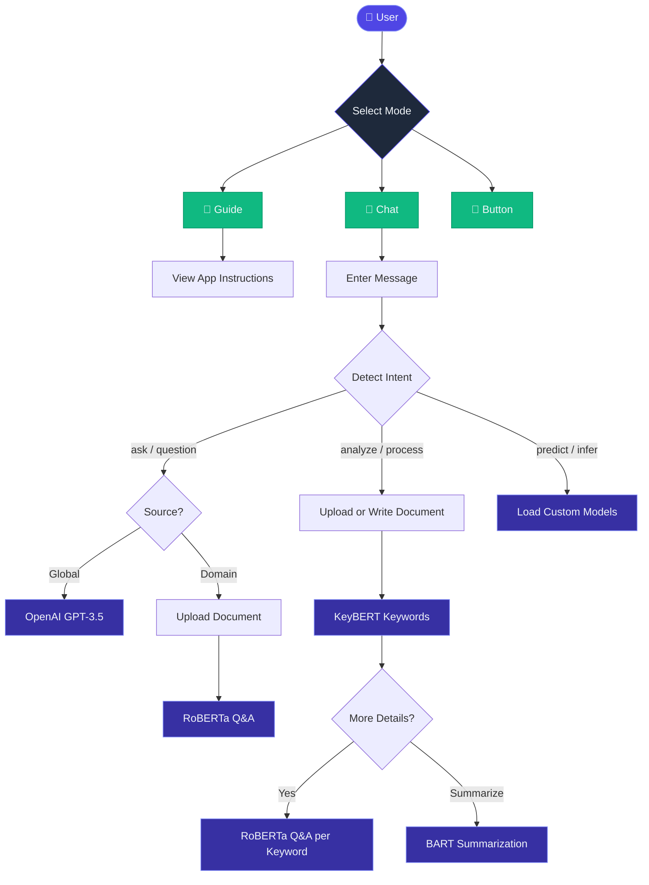

```mermaid
flowchart TD
    A([🙂 User]) --> B{Select Mode}

    B --> G[📖 Guide]
    B --> C[💬 Chat]
    B --> D[🔘 Button]

    G --> G1[View App Instructions]

    C --> C1[Enter Message]
    C1 --> C2{Detect Intent}

    C2 -->|ask / question| Q{Source?}
    Q -->|Global| Q1[OpenAI GPT-3.5]
    Q -->|Domain| Q2[Upload Document]
    Q2 --> Q3[RoBERTa Q&A]

    C2 -->|analyze / process| A1[Upload or Write Document]
    A1 --> A2[KeyBERT Keywords]
    A2 --> A3{More Details?}
    A3 -->|Yes| A4[RoBERTa Q&A per Keyword]
    A3 -->|Summarize| A5[BART Summarization]

    C2 -->|predict / infer| P1[Load Custom Models]

    style A fill:#4f46e5,stroke:#818cf8,color:#f1f5f9
    style B fill:#1e293b,stroke:#4f46e5,color:#f1f5f9
    style G fill:#10b981,stroke:#059669,color:#f1f5f9
    style C fill:#10b981,stroke:#059669,color:#f1f5f9
    style D fill:#10b981,stroke:#059669,color:#f1f5f9
    style Q1 fill:#3730a3,stroke:#818cf8,color:#f1f5f9
    style Q3 fill:#3730a3,stroke:#818cf8,color:#f1f5f9
    style A2 fill:#3730a3,stroke:#818cf8,color:#f1f5f9
    style A4 fill:#3730a3,stroke:#818cf8,color:#f1f5f9
    style A5 fill:#3730a3,stroke:#818cf8,color:#f1f5f9
    style P1 fill:#3730a3,stroke:#818cf8,color:#f1f5f9
```
